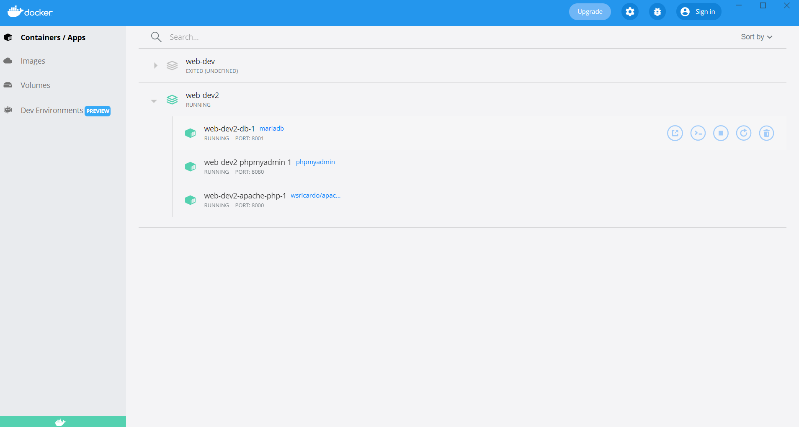

# debian-amp
Debian server docker compose with Apache, MariaDB and PHP.

WEB Page https://wsricardo.blogspot.com

## Use

### How to

The files configurations and dockerfiles in the folder "src". You can copy
files for your directory of development.

./
  - dockerfiles/
    - debian-apache
  - docker-compose.yml

### Build Image

First step build Debian apache Server

``
  $ docker build -t wsricardo/debian-amp -f dockerfiles/debian-apache
``

### Docker compose environment

In second step run 'docker compose' comando for create environment.

``
  $ docker-compose up
``

## For Windows Users

  See in Docker Desktop its container for Apache server, phpmyadmin and MariaDB are running.

  

[WSRicardo's Blog](https://wsricardo.blogspot.com)

[EVirtus Software Solutions and Book Library ](http://www.evirtus.com.br)
